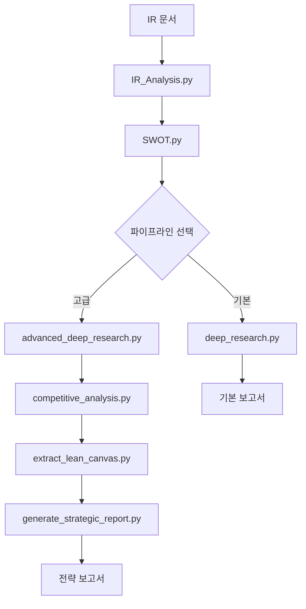

# QVP: AI-Powered Investment Research Platform

LLM 기반의 포괄적인 투자 분석 플랫폼으로, 기업 IR 문서부터 최종 전략 보고서까지 엔드투엔드 분석 파이프라인을 제공합니다.

## 프로젝트 개요

QVP (Quantitative & Qualitative Venture-Capital Partner)는 AI 에이전트들이 협력하여 스타트업 투자 분석을 수행하는 종합 분석 플랫폼입니다. 단순한 정보 추출을 넘어서 웹 검색 검증, 경쟁사 분석, 린 캔버스 작성, 전략 수립까지 전 과정을 자동화합니다.

## 핵심 기능

### 🔍 **지능형 정보 추출**
- **반복 학습 추출**: LangGraph 기반으로 추출 실패 시 원인 분석 후 재시도
- **병렬 처리**: 멀티 LLM을 활용한 고속 정보 처리
- **구조화된 데이터**: 60개 이상의 필드를 체계적으로 추출

### 📊 **다층 분석 시스템**
- **SWOT 분석**: 내부/외부, 긍정/부정 요인을 전문 에이전트가 분석
- **웹 검증 리서치**: ReAct 에이전트가 웹 검색으로 분석 내용 검증
- **경쟁사 분석**: 스타트업 중심의 경쟁 환경 분석
- **린 캔버스**: 9가지 비즈니스 모델 요소 자동 추출

### 🚀 **전략 보고서 생성**
- **LangGraph 기반**: 다단계 검증 과정을 통한 고품질 보고서
- **실행 가능한 권고안**: 구체적인 액션 플랜 제시
- **한영 이중 언어**: 분석 정확성과 가독성 모두 확보

### 🔧 **부가 기능**
- **RAG 기반 질의응답**: 문서 임베딩을 통한 인터랙티브 질의
- **시각화 도구**: Rich 라이브러리 기반 터미널 출력
- **파이프라인 자동화**: 전체 과정의 원클릭 실행

## 아키텍처 & 워크플로우

### 기본 파이프라인 (Basic Pipeline)
```
IR 문서 → IR 분석 → SWOT 분석 → 딥 리서치 → 보고서
```

### 고급 파이프라인 (Advanced Pipeline) - **권장**
```
SWOT 분석 → 고급 딥 리서치 → 경쟁사 분석 → 린 캔버스 → 전략 보고서
```

### 실행 흐름도


## 파일 구조 및 역할

### 핵심 분석 모듈
- **`IR_Analysis.py`**: 기업 IR 문서에서 투자 정보 추출 (LangGraph 기반)
- **`Multi_IR_Analysis.py`**: 병렬 처리를 통한 고속 IR 분석
- **`SWOT.py`**: 4가지 관점별 전문 에이전트 SWOT 분석
- **`deep_research.py`**: 웹 검색 기반 분석 검증 (ReAct 에이전트)
- **`advanced_deep_research.py`**: 고도화된 리서치 및 요약 기능
- **`competitive_analysis.py`**: 스타트업 중심 경쟁사 분석
- **`extract_lean_canvas.py`**: 비즈니스 모델 9요소 추출
- **`generate_strategic_report.py`**: 전략 보고서 생성 (LangGraph 기반)

### 실행 및 유틸리티
- **`run_full_analysis_pipeline.py`**: 전체 파이프라인 자동 실행
- **`view_report.py`**: 보고서 터미널 시각화
- **`embedding_md.py`**: RAG 기반 문서 질의응답

### 변환 도구
- **`convert_json_to_html.py`**: JSON 결과를 HTML로 변환
- **`convert_to_md.py`**: 다양한 형식을 Markdown으로 변환

## 설치 및 설정

### 1. 저장소 복제
```bash
git clone <repository-url>
cd QVP
```

### 2. 의존성 설치
```bash
# UV 패키지 매니저 사용 (권장)
uv pip install -r requirements.txt

# 또는 pip 사용
pip install -r requirements.txt
```

### 3. 로컬 LLM 서버 설정
```bash
# Ollama 설치 및 모델 다운로드
ollama pull qwen3:32b
ollama serve
```

### 4. 서버 주소 설정
각 스크립트에서 `base_url` 확인 및 수정:
```python
# 예시: SWOT.py, deep_research.py 등
base_url="http://192.168.120.102:11434"  # 로컬 환경에 맞게 수정
```

## 사용법

### 기본 사용법 (3단계 파이프라인)

```bash
# 1. IR 분석
python IR_Analysis.py

# 2. SWOT 분석  
python SWOT.py

# 3. 딥 리서치
python deep_research.py
```

### 고급 사용법 (5단계 파이프라인) - **권장**

```bash
# 1. 전체 파이프라인 자동 실행
python run_full_analysis_pipeline.py

# 2. 개별 단계 실행
python advanced_deep_research.py result/swot_analysis_file.json
python competitive_analysis.py bm_result/advanced_report_file.json
python extract_lean_canvas.py bm_result/competitive_report_file.json
python generate_strategic_report.py identifier_string
```

### 부가 기능

```bash
# 보고서 시각화
python view_report.py bm_result/strategic_report_identifier.json

# RAG 기반 질의응답
python embedding_md.py

# 병렬 IR 분석
python Multi_IR_Analysis.py
```

## 기술 스택

### 핵심 AI 프레임워크
- **LangChain**: 에이전트 체인 및 도구 통합
- **LangGraph**: 복잡한 AI 워크플로우 관리
- **Ollama**: 로컬 LLM 서버 (qwen3:32b)
- **Pydantic**: 데이터 모델링 및 검증

### 외부 도구 및 라이브러리
- **DuckDuckGo Search**: 웹 검색 API
- **SentenceTransformers**: 문서 임베딩 (bge-m3-ko)
- **Rich**: 터미널 출력 시각화
- **ThreadPoolExecutor**: 병렬 처리

## 입출력 구조

### 입력 파일
- **IR 문서**: `data/*.md` (Markdown 형식의 기업 정보)
- **SWOT 분석**: `result/swot_analysis_*.json`

### 출력 파일

#### 기본 파이프라인
- `result/robos_gt.json`: 추출된 기업 정보
- `result/swot_analysis.json`: SWOT 분석 결과
- `result/deep_research_report_*.json`: 딥 리서치 보고서

#### 고급 파이프라인
- `bm_result/advanced_deep_research_report_*.json`: 고급 리서치 결과
- `bm_result/competitive_analysis_report_*.json`: 경쟁사 분석 보고서
- `bm_result/lean_canvas_*.json`: 린 캔버스
- `bm_result/strategic_report_*.json`: 최종 전략 보고서

## 모델 설정

### 지원하는 LLM 모델
- **주요 모델**: qwen3:32b (권장)
- **서버 설정**: Ollama 로컬 서버
- **온도 설정**: 0.0 (분석용) / 0.3 (창작용)

### 성능 최적화
- **병렬 처리**: Multi_IR_Analysis.py 활용
- **청크 처리**: 대용량 문서의 분할 처리
- **캐싱**: 중간 결과물 저장으로 재실행 최적화

## 확장 가능성

### 추가 가능한 기능
- 다른 LLM 모델 지원 (GPT, Claude 등)
- 웹 인터페이스 구축
- 데이터베이스 연동
- 실시간 시장 데이터 통합
- 자동 보고서 스케줄링

### 커스터마이징
- 분석 필드 추가/수정
- 프롬프트 최적화
- 출력 형식 변경
- 언어 지원 확장

---

**QVP는 AI 기반 투자 분석의 새로운 패러다임을 제시합니다. LLM의 추론 능력과 구조화된 데이터 처리를 결합하여, 투자 전문가 수준의 분석을 자동화합니다.**
